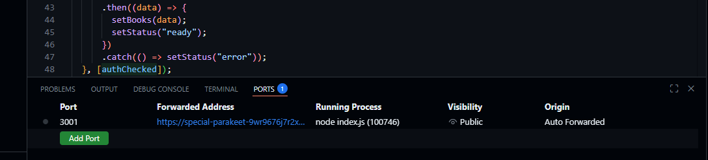

# api

Simple Node/Express API with stubbed book data, used for local development
against the static site in [src/web](../web).

## Run locally

```bash
cd src/api
npm install
npm start        # or `npm run dev` for auto-restart on changes
```

The server listens on `http://localhost:3001` by default (override with the
`PORT` env var). CORS is wide open (`cors()` with defaults) so the site can
fetch from it during local development.

## Endpoints

- `GET /` — redirects to `/api-docs`
- `GET /health` — health check
- `GET /api/books` — list all books
- `GET /api/books/:id` — get a single book by id
- `POST /api/auth/login` — log in with `{ username, password }`, returns a token
- `GET /api/auth/me` — resolve the current token (`Authorization: Bearer <token>`) to a user
- `POST /api/auth/logout` — invalidate a token
- `GET /api-docs` — Swagger UI
- `GET /openapi.json` — raw OpenAPI spec

Auth is a stub: credentials are hardcoded in
[data/users.js](data/users.js) (`admin` / `password123`), and tokens live
in an in-memory `Map` that resets whenever the API restarts.

## Reaching this from the deployed site

The site in `src/web` points at this API via `API_BASE_URL` in
[src/web/lib/api.js](../web/lib/api.js) — **update that value** if this API's
address changes (a different Codespace, a tunnel URL, etc.). That URL is
only reachable if this API is actually forwarded and public. If you're
running in a Codespace, that means forwarding port 3001 and setting its
visibility to **Public** (`gh codespace ports visibility 3001:public`) —
otherwise cross-origin requests get redirected to a GitHub auth page instead
of JSON. This is a stopgap; the plan is to front this API with a tunnel
(chisel or rathole) instead of relying on Codespaces port forwarding.

In the Codespace's **Ports** tab, port 3001 should show `Public` visibility,
as below:


